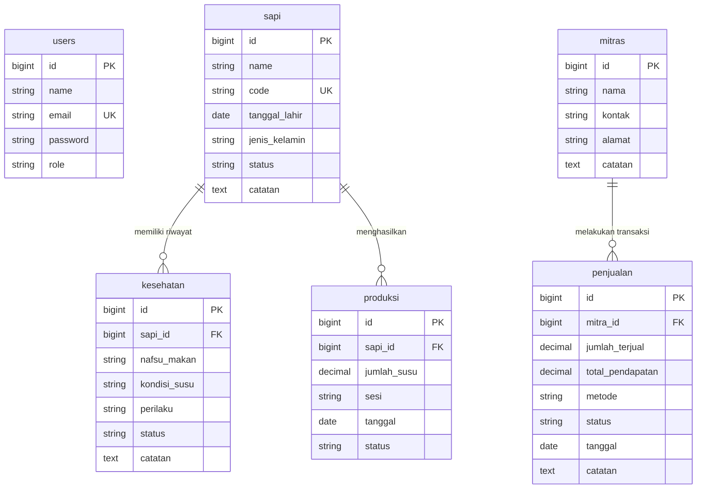

# PRODUCT REQUIREMENTS DOCUMENT (PRD)

# COMPANY PROFILE + MONITORING & CMS PETERNAKAN SAPI PERAH "PARMAN FARM"

**Dokumen Kebutuhan Produk (PRD) Komprehensif — Parman Farm Monitoring System**

---

| Field | Isi / Keterangan |
| :--- | :--- |
| **Project Name** | Parman Farm Monitoring & Management System (Public Website & Multi-Role CMS) |
| **Project Type** | Company Profile Website + Farm Management System (SaaS ERP Peternakan Sapi Perah) |
| **Public Website** | [https://suparmanfarms.my.id](https://suparmanfarms.my.id) |
| **CMS / Stack** | Laravel 11 (PHP 8.3), Blade Templating, Live Data Polling API, Chart.js, TailwindCSS, MySQL / MariaDB |
| **Team** | 5 Role/Fokus (Tech Lead / Developer, Frontend Dev, Backend Dev, UI/UX Designer, Quality Assurance) |
| **PLC / Mentor / Client** | Julian (Owner Suparman Farms) & David Stanley (Lead Developer) |
| **Version** | 1.0 (Production Deployed & Handed Over) |
| **Status** | Approved & Live Production |
| **Date** | 22/09/2026 |

---

> **CARA MENGGUNAKAN DOKUMEN INI:** Dokumen PRD ini disusun sesuai standar pengembangan aplikasi profesional berbasis template PRD Tim Magang / Software House. Mengatur seluruh scope fungsional, arsitektur data, spesifikasi fitur public & CMS, kontrak API, skenario pengujian (QA & UAT), hingga persetujuan final (Sign-off) untuk proyek Parman Farm.

---

## 1. Gambaran Besar Project

Bagian ini menjelaskan latar belakang, tujuan bisnis, dan pengguna dari sistem manajemen Parman Farm.

### 1.1 Tujuan Project
Tujuan pembuatan website & aplikasi CMS Parman Farm adalah:
1. **Memperkenalkan Identitas & Kredibilitas:** Menampilkan profil peternakan sapi perah modern Parman Farm secara profesional kepada calon mitra industri (seperti Greenfields, Pabrik Pengolahan Susu) dan masyarakat umum.
2. **Digitalisasi Operasional Peternakan:** Menggantikan pencatatan manual berbasis kertas menjadi sistem digital terpusat untuk memantau kesehatan populasi sapi dan volume perahan susu harian.
3. **Manajemen Transaksi Komersial:** Mencatat dan memantau transaksi penjualan susu kepada mitra serta menghitung pendapatan secara real-time.
4. **Analisis & Pelaporan Otomatis:** Menyediakan dashboard visual interaktif (grafik tren produksi & kesehatan) serta fitur cetak laporan operasional dan keuangan periodik bagi Owner.

### 1.2 Target Pengguna

| Pengguna | Siapa? | Tujuan |
| :--- | :--- | :--- |
| **Pengunjung Website (Visitor)** | Calon mitra bisnis/pabrik susu, konsumen publik, masyarakat umum | Mencari informasi profil peternakan, keunggulan mutu susu segar, data statistik produksi, dan kontak kerja sama. |
| **Owner (Pemilik Peternakan)** | Julian / Management Suparman Farms | Memantau KPI bisnis (total pendapatan, grafik tren penjualan, statistik kesehatan ternak), mengelola data mitra, mencetak laporan, dan mengelola akun karyawan. |
| **Karyawan (Operator Lapangan)** | Staff / Petugas Kandang & Pemerahan | Melakukan input data harian rekam kesehatan sapi (observasi), mencatat hasil perahan susu (pagi & sore), serta mengupdate master data sapi. |

### 1.3 Masalah yang Ingin Diselesaikan
1. **Belum Adanya Profil Digital Resmi:** Sebelumnya Parman Farm belum memiliki media digital resmi untuk memamerkan kapasitas produksi dan standar kualitas susu murni, sehingga sulit menjangkau mitra industri skala besar.
2. **Pencatatan Operasional Manual & Berrisiko Hilang:** Data kesehatan sapi dan hasil perahan harian dicatat manual di buku catatan kandang, rawan rusak, hilang, dan sulit dianalisis tren historisnya.
3. **Kesulitan Pemantauan Kesehatan Ternak:** Tanpa peringatan status (*Normal*, *Perlu Pemantauan*, *Perlu Tindakan*), sapi yang mulai sakit sering terlambat ditangani, mengganggu kualitas susu secara keseluruhan.
4. **Rekapitulasi Keuangan Lambat:** Pemilik kesulitan menghitung total pendapatan bulanan dan performa penjualan per mitra secara cepat karena data penjualan terpisah.

### 1.4 Hasil yang Diharapkan
- Website Public Company Profile dapat diakses publik 24/7 secara responsif dan cepat.
- Dashboard menampilkan statistik real-time produksi dan status kesehatan sapi melalui mekanisme polling API.
- Hak akses berbasis peran (*Role-Based Access Control*) terpisah antara Owner dan Karyawan.
- Data operasional (Sapi, Kesehatan, Produksi, Mitra, Penjualan) tersimpan aman di database MySQL yang berelasi dengan benar.
- Fitur cetak laporan operasional/keuangan siap pakai dengan filter tanggal.

---

## 2. Scope Project

### 2.1 Public Company Profile — In Scope
- [x] **Home / Beranda:** Hero section dengan slogan peternakan modern & CTA login/kontak.
- [x] **Live Stats Bar:** Widget statistik real-time (Total Sapi, Rata-rata Produksi Harian 30 hari, Total Produksi Bulan Ini).
- [x] **About / Tentang Perusahaan:** Profil Parman Farm, sejarah, dan standar kebersihan kandang.
- [x] **Vision & Mission:** Visi menyediakan susu murni segar berkualitas tinggi & misi peternakan berkelanjutan.
- [x] **Services & Products / Produk & Layanan:** Penjelasan produk unggulan (Susu Sapi Murni Fresh Milk) & layanan kemitraan pasokan industri.
- [x] **Contact & Location:** Informasi alamat, WhatsApp, email, dan petunjuk lokasi.
- [x] **Footer & Social Media Links:** Navigasi cepat dan tautan media sosial.
- [x] **SEO Basic & Metadata:** Dynamic page title, meta description, Open Graph metadata.

### 2.2 CMS & ERP Monitoring — In Scope
- [x] **Login & Logout Multi-Role:** Autentikasi aman untuk Owner dan Karyawan/Operator.
- [x] **Dashboard Owner:** Ringkasan KPI keuangan, grafik tren omzet penjualan bulanan, statistik kesehatan sapi (Chart.js), dan live auto-refresh.
- [x] **Dashboard Karyawan:** Ringkasan tugas harian pemerahan dan daftar observasi medis terkini.
- [x] **Manajemen Data Sapi (Master Sapi):** CRUD data sapi (Nama, Kode Unik Tag, Status Klinis, Tanggal Lahir, Jenis Kelamin, Catatan).
- [x] **Manajemen Observasi Kesehatan Sapi:** Catatan harian nafsu makan, kondisi susu, perilaku, status medis (*Normal*, *Perlu Pemantauan*, *Perlu Tindakan*), serta update otomatis ke dashboard.
- [x] **Manajemen Produksi Susu:** Recording volume perahan susu (liter), sesi perahan (Pagi / Sore), tanggal, dan status pencatatan.
- [x] **Manajemen Mitra Industri:** CRUD data mitra pembeli (Nama Perusahaan/Mitra, Kontak, Alamat, Catatan).
- [x] **Manajemen Transaksi Penjualan:** Recording penjualan susu ke mitra, volume terjual, total pendapatan (Rp), metode pembayaran, dan status transaksi.
- [x] **Laporan & Export:** Generator laporan operasional & keuangan dengan filter rentang tanggal serta fitur cetak/PDF.
- [x] **Manajemen User / Karyawan (Owner Only):** Pengelolaan akun pengguna dan kata sandi staff kandang.

### 2.3 Out of Scope
- [ ] Integrasi Pembayaran Online Automatic Gateway (Midtrans/Xendit) — Penjualan dicatat manual berbasis Transfer Bank/Tunai.
- [ ] Notifikasi Otomatis WhatsApp / SMS Gateway.
- [ ] Aplikasi Mobile Native (iOS / Android) — Menggunakan Responsive Web App.

---

## 3. Pembagian Tim (5 Role / PIC)

| Anggota Tim | Role / Fokus | Tanggung Jawab Utama |
| :--- | :--- | :--- |
| **David Stanley** | Tech Lead & Full-Stack Developer | Penanggung jawab teknis, setup arsitektur Laravel, backend API, controller logic, dan deployment server. |
| **Jovan Ehren** | Backend Developer | Perancangan skema database MySQL, migrasi, seeder, dan query agregasi laporan keuangan/produksi. |
| **Adrial** | Frontend Developer | Slicing tampilan Blade UI, styling TailwindCSS/Vanilla CSS, integrasi Chart.js, dan animasi UI. |
| **Adika** | UI/UX Designer | Perancangan wireframe, prototype Figma, desain responsive layout desktop & mobile, serta sistem ikon. |
| **Jovan Purba** | Quality Assurance (QA) | Penyusunan dokumen PRD, pembuatan lembar uji QA & UAT, pengujian bug fungsional, dan validasi keamana. |

---

## 4. Struktur Sistem yang Dipahami Tim

### Komponen Arsitektur Sistem

| Komponen | Fungsi | Teknologi / Catatan |
| :--- | :--- | :--- |
| **Public Website** | Menampilkan landing page profil peternakan & live statistik untuk publik | Laravel Blade, Vanilla CSS / Tailwind, Fetch API Polling |
| **CMS Owner & Karyawan** | Antarmuka aplikasi manajemen operasional & pencatatan ternak | Laravel Blade, Chart.js, Live Polling API, Modal UI |
| **Backend Framework** | Menangani routing, business logic, validasi, autentikasi & otorisasi | Laravel 11 (PHP >= 8.3) |
| **Database Storage** | Menyimpan master data user, sapi, kesehatan, produksi, mitra, penjualan | MySQL / MariaDB >= 10.4 |
| **API Endpoints** | Polling statistik real-time landing page & dashboard CMS | REST JSON Endpoints (`/api/landing-stats`, `/owner/api/*`) |

### Flow Diagram Sederhana

```
[ Visitor / Public ] ──GET /──> [ Public Landing Page (Blade) ] ──FETCH /api/landing-stats──> [ Backend API ] ──> [ MySQL DB ]
                                                                                                    │
[ Owner / Karyawan ] ──POST /login──> [ CMS Auth Middleware ] ──Role Check (owner/karyawan)───────┤
                                                │
                                       [ CMS Dashboard & Modules ] ──CRUD Operations───────────────┘
```

---

## 5. User Role & Permission

### Hak Akses Pengguna

| Role | Akses Utama | Boleh Melakukan | Tidak Boleh Melakukan |
| :--- | :--- | :--- | :--- |
| **Visitor** | Public Landing Page | Melihat profil peternakan, melihat live statistik produksi, mengakses informasi kontak & lokasi. | Mengakses area CMS, melihat data keuangan internal, mengedit konten. |
| **Owner** | Full CMS Admin | Login CMS, CRUD Sapi, CRUD Kesehatan, CRUD Produksi, CRUD Mitra, CRUD Penjualan, Cetak Laporan, Kelola Akun Karyawan. | Mengakses modul di luar ketentuan sistem. |
| **Karyawan** | Operasional CMS | Login CMS, CRUD Sapi, Input Observasi Kesehatan, Input Produksi Susu Harian, melihat Dashboard Karyawan. | Melihat laporan keuangan/omzet penjualan, mengelola data mitra, mengelola akun user lain. |

### Matrix Permission Modul

| Modul CMS | Role Owner (View / Create / Update / Delete / Export) | Role Karyawan (View / Create / Update / Delete / Export) |
| :--- | :---: | :---: |
| **Dashboard Analytics** | ✓ / — / — / — / — | ✓ (Limit Karyawan) / — / — / — / — |
| **Master Data Sapi** | ✓ / ✓ / ✓ / ✓ / — | ✓ / ✓ / ✓ / ✓ / — |
| **Observasi Kesehatan**| ✓ / ✓ / ✓ / ✓ / — | ✓ / ✓ / ✓ / ✓ / — |
| **Produksi Susu** | ✓ / ✓ / ✓ / ✓ / — | ✓ / ✓ / ✓ / ✓ / — |
| **Mitra Industri** | ✓ / ✓ / ✓ / ✓ / — | — / — / — / — / — |
| **Penjualan Susu** | ✓ / ✓ / ✓ / ✓ / — | — / — / — / — / — |
| **Laporan & Export** | ✓ / — / — / — / ✓ (Cetak PDF) | — / — / — / — / — |
| **Kelola Karyawan** | ✓ / ✓ / ✓ / ✓ / — | — / — / — / — / — |

---

## 6. Struktur Navigasi Public Website

### Tabel Sitemap Landing Page

| Menu Navigasi | URL / Route Name | Halaman / Section Target | Dinamis dari CMS / Database? | Catatan |
| :--- | :--- | :--- | :---: | :--- |
| **Beranda** | `/` (`landing`) | Hero Section & Banner Utama | Static Text / Dynamic Badge | Menampilkan tombol login & CTA WhatsApp |
| **Statistik Real-time**| `/` (Section Stats) | Widget Angka Produksi & Sapi | **Dinamis** (`/api/landing-stats`) | Auto-refresh via polling Javascript (5 min) |
| **Tentang Kami** | `/#about` | Profil & Standar Mutu Kandang | Static | Gambaran filosofi higiene Parman Farm |
| **Visi & Misi** | `/#visi-misi` | Visi & Misi Peternakan | Static | Poin komitmen mutu susu segar |
| **Produk & Layanan**| `/#layanan` | Katalog Susu Murni & Kemitraan | Static | Informasi spesifikasi produk susu segar |
| **Kontak & Lokasi** | `/#contact` | Informasi Alamat & WhatsApp | Static | Link langsung ke WhatsApp Owner |

---

## 7. Struktur Menu CMS Laravel

| Menu CMS | Submenu | Data yang Dikelola | Hak Akses CRUD | PIC Responsible |
| :--- | :--- | :--- | :---: | :--- |
| **Dashboard Owner** | - | Analytics KPI, Grafik Omzet Penjualan, Pie Chart Kesehatan Sapi | Read / Live Refresh | David Stanley |
| **Dashboard Karyawan**| - | Ringkasan tugas harian kandang & input cepat | Read | Adrial |
| **Data Sapi** | Master Sapi | Identitas Sapi (Nama, Kode Unik, Tgl Lahir, Status, Catatan) | C / R / U / D | Jovan Ehren |
| **Observasi Kesehatan**| Rekam Medis | Log harian nafsu makan, kondisi susu, perilaku, status medis | C / R / U / D | Adrial |
| **Produksi Susu** | Hasil Perahan | Volume perahan susu (liter), sesi perahan (pagi/sore), tanggal | C / R / U / D | Jovan Ehren |
| **Penjualan Susu** | Transaksi Penjualan | Record transaksi penjualan susu per mitra, nominal Rp, metode bayar | C / R / U / D | David Stanley |
| **Mitra Industri** | Data Mitra | Profil mitra industri (Nama, Kontak, Alamat, Catatan) | C / R / U / D | David Stanley |
| **Laporan** | Laporan Operasional | Aggregated data produksi & penjualan dengan filter tanggal + Print | R / Export PDF | David Stanley |
| **Kelola Karyawan** | Users Management | Data akun user/karyawan (Nama, Email/Username, Password, Role) | C / R / U / D | David Stanley |

---

## 8. Content Model — Apa yang Bisa Diubah Admin?

| Halaman / Modul | Section / Field | Static / Dynamic | Field yang Bisa Diubah via CMS | Ada Media / File Upload? |
| :--- | :--- | :---: | :--- | :---: |
| **Master Sapi** | Form Sapi | Dynamic | `name`, `code`, `tanggal_lahir`, `jenis_kelamin`, `status`, `catatan` | Tidak |
| **Observasi Kesehatan**| Form Kesehatan | Dynamic | `sapi_id`, `nafsu_makan`, `kondisi_susu`, `perilaku`, `status`, `catatan` | Tidak |
| **Produksi Susu** | Form Produksi | Dynamic | `sapi_id`, `jumlah_susu`, `sesi`, `tanggal`, `status` | Tidak |
| **Mitra Industri** | Form Mitra | Dynamic | `nama`, `kontak`, `alamat`, `catatan` | Tidak |
| **Penjualan Susu** | Form Penjualan | Dynamic | `mitra_id`, `jumlah_terjual`, `total_pendapatan`, `metode`, `status`, `catatan`, `tanggal` | Tidak |
| **Users / Karyawan** | Form User | Dynamic | `name`, `email` / username, `password`, `role` | Tidak (Default Avatar) |

---

## 9. Detail Fitur Public Website

### PUB-001: Landing Page Hero & Navigasi
- **Feature ID:** `PUB-001`
- **Nama Feature:** Landing Page Main Hero & Header Navigation
- **Tujuan:** Memberikan kesan pertama yang profesional bagi pengunjung serta menyediakan akses cepat ke navigasi dan portal login CMS.
- **Actor:** Pengunjung / Visitor
- **Input:** Klik Link Navigasi / Klik Tombol "Login System" / Klik "Hubungi Kami"
- **Output:** Scroll halus ke section target atau pengalihan ke halaman `/login`.
- **Data Source:** Static Blade Template
- **Main Flow:**
  1. Visitor membuka URL `https://suparmanfarms.my.id`.
  2. Website menampilkan header dengan logo Parman Farm, menu navigasi, dan banner utama.
  3. Visitor dapat menekan tombol "Login System" untuk masuk ke portal CMS.
- **Error State:** Halaman 404 jika URL tidak valid.

### PUB-002: Live Production Statistics Bar
- **Feature ID:** `PUB-002`
- **Nama Feature:** Real-Time Production & Livestock Stats Counter
- **Tujuan:** Menampilkan data kapasitas produksi aktual Parman Farm secara transparan untuk membangun kepercayaan calon mitra.
- **Actor:** Pengunjung / Visitor
- **Input:** Autoload halaman / Polling interval 5 menit.
- **Output:** Tampilan counter angka dinamis: Total Sapi Aktif, Rata-rata Produksi Harian (Liter), Total Produksi Bulan Ini (Liter).
- **Data Source:** Dynamic Endpoint JSON (`/api/landing-stats`)
- **Main Flow:**
  1. Halaman dimuat, script melakukan `fetch('/api/landing-stats')`.
  2. Sistem mengkalkulasikan query total sapi dan agregasi `SUM(jumlah_susu)` dari database.
  3. Angka pada widget statistik diperbarui secara halus (*counter animation*).
- **Empty State:** Menampilkan angka `0` jika belum ada data terdaftar.

---

### 9.1 Acceptance Criteria Public Website

| ID Criteria | Given (Kondisi) | When (Aksi) | Then (Hasil yang Terjadi) |
| :--- | :--- | :--- | :--- |
| **AC-PUB-001** | Visitor belum login | Mengakses URL utama `/` | Halaman landing page tampil utuh lengkap dengan navigasi dan hero banner. |
| **AC-PUB-002** | Visitor membuka landing page | Halaman selesai dimuat | Widget statistik memanggil endpoint `/api/landing-stats` dan menampilkan angka total sapi & produksi secara dinamis. |
| **AC-PUB-003** | Visitor menekan tombol "Login System" | Mengklik tombol login | Browser melakukan pengalihan (*redirect*) secara mulus ke halaman `/login`. |

---

## 10. Detail Fitur CMS Laravel

### CMS-001: Dashboard Analytics & Real-Time KPI (Owner)
- **Feature ID:** `CMS-001`
- **Module:** Executive Dashboard
- **Actor:** Owner
- **Route / Menu:** `/owner/dashboard` (`owner.dashboard`)
- **Fungsi Utama:** Visualisasi performa bisnis dalam bentuk Stat Cards (Total Sapi, Produksi Harian, Omzet Bulan Ini, Sapi Perlu Tindakan) dan Chart interaktif (Grafik Omzet Penjualan & Donut Chart Kesehatan Sapi).
- **Validation:** Wajib terautentikasi dengan role `owner`.
- **Live Data:** Menggunakan polling endpoint `/owner/api/dashboard-stats` setiap 30 detik untuk memperbarui widget tanpa reload halaman.

### CMS-002: Master Data Sapi
- **Feature ID:** `CMS-002`
- **Module:** Data Sapi (Livestock Management)
- **Actor:** Owner & Karyawan
- **Route / Menu:** `/owner/sapi` & `/karyawan/sapi`
- **Field Form:** `name` (string, max 20), `code` (string, unique, max 10), `tanggal_lahir` (date), `jenis_kelamin` (enum: Betina/Jantan), `status` (enum: *normal*, *perlu_pemantauan*, *perlu_tindakan*), `catatan` (text).
- **List Page Display:** Tabel dengan pagination, pencarian, dan badge indikator warna status kesehatan.
- **Delete Behavior:** Soft/Hard Delete dengan alert konfirmasi modal.

### CMS-003: Observasi & Rekam Kesehatan Sapi
- **Feature ID:** `CMS-003`
- **Module:** Observasi Kesehatan (Medical Log)
- **Actor:** Owner & Karyawan
- **Route / Menu:** `/owner/kesehatan` & `/karyawan/kesehatan`
- **Field Form:** `sapi_id` (foreign key), `nafsu_makan` (Baik/Menurun/Sangat Buruk), `kondisi_susu` (Normal/Encer/Bercampur Darah), `perilaku` (Aktif/Lemas/Gelisah), `status` (Normal/Perlu Pemantauan/Perlu Tindakan), `catatan` (text).
- **Automation Logic:** Memperbarui kolom `status` pada tabel `sapi` terkait secara otomatis sesuai status pemeriksaan terbaru.

### CMS-004: Pencatatan Produksi Susu Harian
- **Feature ID:** `CMS-004`
- **Module:** Produksi Susu (Milking Records)
- **Actor:** Owner & Karyawan
- **Route / Menu:** `/owner/produksi` & `/karyawan/produksi`
- **Field Form:** `sapi_id` (foreign key), `jumlah_susu` (decimal, liter), `sesi` (pagi/sore), `tanggal` (date), `status` (Tersimpan/Belum Input).
- **List Page Display:** Tabel riwayat perahan harian per sapi, dengan total kalkulasi volume perahan harian.

### CMS-005: Manajemen Mitra Industri & Pembeli
- **Feature ID:** `CMS-005`
- **Module:** Data Mitra (Partnership Management)
- **Actor:** Owner
- **Route / Menu:** `/owner/mitra`
- **Field Form:** `nama` (string), `kontak` (string/phone), `alamat` (string), `catatan` (text).
- **Relation:** Terhubung sebagai Foreign Key `mitra_id` pada modul Penjualan Susu.

### CMS-006: Pencatatan Transaksi Penjualan Susu
- **Feature ID:** `CMS-006`
- **Module:** Penjualan Susu (Sales Management)
- **Actor:** Owner
- **Route / Menu:** `/owner/penjualan`
- **Field Form:** `mitra_id` (foreign key), `jumlah_terjual` (decimal, liter), `total_pendapatan` (decimal, Rp), `metode` (Transfer Bank / Tunai), `status` (Selesai / Pending / Dibatalkan), `tanggal` (date), `catatan` (text).

### CMS-007: Generasi Laporan & Export (PDF / Print)
- **Feature ID:** `CMS-007`
- **Module:** Laporan Operasional & Keuangan
- **Actor:** Owner
- **Route / Menu:** `/owner/laporan` & `/owner/laporan/export`
- **Input Filter:** `tanggal_awal` (date) & `tanggal_akhir` (date).
- **Output:** Rekapitulasi total volume produksi per sapi, total transaksi omzet penjualan per mitra, dan layout cetak ramah printer / PDF.

---

### 10.1 Acceptance Criteria CMS Laravel

| ID Criteria | Given (Kondisi) | When (Aksi) | Then (Hasil yang Terjadi) |
| :--- | :--- | :--- | :--- |
| **AC-CMS-001** | User menginput form Sapi dengan `code` yang sudah terdaftar | Menekan tombol "Simpan" | System menolak dan menampilkan pesan error validasi *"Kode sapi sudah digunakan"*. |
| **AC-CMS-002** | Karyawan menambah rekam kesehatan dengan status *"Perlu Tindakan"* | Menekan tombol "Simpan" | Data kesehatan tersimpan dan status pada tabel `sapi` serta widget dashboard otomatis berubah menjadi *"Perlu Tindakan"*. |
| **AC-CMS-003** | Owner memfilter laporan tanggal 01/07/2026 s/d 31/07/2026 | Klik tombol "Filter" & "Cetak" | Sistem menampilkan dan mencetak rekapitulasi data produksi & penjualan sesuai rentang tanggal tersebut. |
| **AC-CMS-004** | Karyawan mencoba mengakses URL `/owner/laporan` | Mengetik URL di browser | System memblokir akses dan mengembalikan error `403 Forbidden` / Redirect ke Dashboard Karyawan. |

---

## 11. Authentication & Authorization CMS

### Tabel Skenario Login

| Scenario | Input Credential | Expected Result / System Behavior |
| :--- | :--- | :--- |
| **Login Success (Owner)** | `email: owner`, `password: 12345678` | Autentikasi berhasil, session dibuat, redirect ke `/owner/dashboard`. |
| **Login Success (Karyawan)** | `email: karyawan`, `password: 12345678` | Autentikasi berhasil, session dibuat, redirect ke `/karyawan/dashboard`. |
| **Password Salah** | Username benar, Password salah | Login ditolak, tampil pesan error validasi *"Kredensial yang dimasukkan tidak cocok."* |
| **User Tidak Ditemukan** | Username acak yang tidak terdaftar | Login ditolak, tampil pesan error validasi. |
| **Akses Direct URL Tanpa Login** | Membuka `/owner/dashboard` langsung | Redirect otomatis ke halaman `/login` dengan pesan flash alert. |
| **Session Expired** | Inaktif melebihi batas session timeout | User diminta login kembali saat mengklik menu. |
| **Unauthorized Role Access** | User `karyawan` mengakses `/owner/mitra` | HTTP 403 Forbidden / Access Denied. |

### Credential Default System (Seed Data)
- **Akun Owner:** Username/Email: `owner` | Password: `12345678` | Role: `owner`
- **Akun Karyawan:** Username/Email: `karyawan` | Password: `12345678` | Role: `karyawan`

---

## 12. Media / Image Management

| Item | Requirement / Aturan Teknis |
| :--- | :--- |
| **Format File Gambar** | JPG, PNG, WEBP, SVG |
| **Max File Size** | Maximum 2 MB per file upload |
| **Dimension Standard** | Optimal 1200x800 px (Aspek rasio 16:9 atau 4:3 untuk foto ternak/kandang) |
| **Storage Directory** | Local Disk Storage (`storage/app/public/...` disimlink ke `public/storage`) |
| **File Naming Convention** | `{timestamp}_{slug_nama_file}.{extension}` (mencegah bentrok nama file) |
| **Delete Behavior** | File fisik terhapus dari disk saat record database dihapus (*clean up*) |

---

## 13. Database / ERD

### Skema Entitas Database Utama

| Entity / Table | Purpose | Key Fields | Relationship |
| :--- | :--- | :--- | :--- |
| **`users`** | Akun pengguna sistem (Owner & Karyawan) | `id` (PK), `name`, `email` (unique), `password`, `role` | - |
| **`sapi`** | Master data populasi sapi perah | `id` (PK), `name`, `code` (unique), `tanggal_lahir`, `jenis_kelamin`, `status`, `catatan` | 1 to Many ke `kesehatan` & `produksi` |
| **`kesehatan`** | Log riwayat observasi medis sapi | `id` (PK), `sapi_id` (FK), `nafsu_makan`, `kondisi_susu`, `perilaku`, `status`, `catatan` | Many to 1 ke `sapi` |
| **`produksi`** | Log volume perahan susu harian | `id` (PK), `sapi_id` (FK), `jumlah_susu`, `sesi`, `tanggal`, `status` | Many to 1 ke `sapi` |
| **`mitras`** | Master profil mitra industri/pembeli | `id` (PK), `nama`, `kontak`, `alamat`, `catatan` | 1 to Many ke `penjualan` |
| **`penjualan`** | Record transaksi komersial penjualan susu | `id` (PK), `mitra_id` (FK), `jumlah_terjual`, `total_pendapatan`, `metode`, `status`, `tanggal`, `catatan` | Many to 1 ke `mitras` |

### Diagram ERD (Mermaid)



---

## 14. API / Backend Contract

| Method | Endpoint Route | Auth Required? | Purpose / Deskripsi | Request Body / Query | Response Format |
| :--- | :--- | :---: | :--- | :--- | :--- |
| **GET** | `/api/landing-stats` | Public (No) | Mengambil agregasi real-time total sapi & statistik produksi untuk Landing Page | - | JSON `{totalSapi, avgDaily, monthlyProduction, updatedAt}` |
| **GET** | `/owner/api/dashboard-stats` | Owner Auth | Dynamic live refresh card & grafik di Dashboard Owner | - | JSON `{stats, salesChart, healthChart}` |
| **GET** | `/owner/api/produksi` | Owner Auth | Polling data perahan terbaru untuk widget live feed | - | JSON `[ {id, sapi_name, jumlah_susu, sesi, tanggal} ]` |
| **GET** | `/owner/api/kesehatan` | Owner Auth | Polling alert sapi sakit / perlu tindakan | - | JSON `[ {id, sapi_code, status, catatan} ]` |

---

## 15. UI/UX & Figma

| Item Design | Standard & Requirement |
| :--- | :--- |
| **Figma Mockup Link** | Available in Project Design Handover Folder |
| **Design Style** | Clean Modern Farm Dashboard with Glassmorphism Cards & Dynamic Micro-animations |
| **Color Palette** | Primary: Emerald Green (`#059669`), Secondary: Amber Orange (`#D97706`), Neutral Dark: Slate (`#0F172A`) |
| **Typography** | Inter / Outfit (Google Fonts) |
| **Responsive Grid** | Desktop (1440px), Tablet (768px), Mobile Screen (375px) |
| **Loading State** | Skeleton loaders & spinner animasi saat data fetching via API |
| **Empty State** | Ilustrasi bersih dengan pesan *"Belum ada data terdaftar. Klik Tambah Data."* |
| **Error State** | SweetAlert2 / Alert Banner merah dengan detail error validasi |

---

## 16. Non-Functional Requirements

- **Performance:** Response time halaman < 1.2 detik; API polling latency < 200 ms.
- **Security:** Autentikasi terenkripsi Bcrypt, Proteksi CSRF Token pada seluruh form POST/PUT/DELETE, Parameterized Queries (Eloquent ORM) bebas SQL Injection, Middleware Role Access Control.
- **Responsiveness:** Support 100% pada tampilan Desktop, Tablet, dan Mobile Browser.
- **Browser Compatibility:** Google Chrome (v110+), Mozilla Firefox (v108+), Safari (v16+), Microsoft Edge (v110+).
- **Backup & Recovery:** Daily automatic database dump script ke `.sql.gz` lokal & cloud.
- **SEO & Metadata:** Semantic HTML5 (`<header>`, `<main>`, `<article>`, `<footer>`), Title tags unik, Meta description.

---

## 17. QA / Test Scenario

| Test ID | Module | Scenario Pengujian | Expected Result | Status |
| :--- | :--- | :--- | :--- | :---: |
| **TC-001** | Authentication | Login dengan kredensial valid Owner | Berhasil masuk dan redirect ke Dashboard Owner | **PASSED** |
| **TC-002** | Authentication | Login dengan password salah | Ditolak dengan pesan error validasi | **PASSED** |
| **TC-003** | Master Sapi | Tambah data sapi baru dengan kode unik `SP-099` | Data tersimpan di DB & muncul di tabel Sapi | **PASSED** |
| **TC-004** | Master Sapi | Input kode sapi duplikat `SP-099` | System menolak dengan pesan error kuesioner duplikasi | **PASSED** |
| **TC-005** | Observasi Medis | Input kesehatan status *"Perlu Tindakan"* | Status Sapi & Donut Chart Dashboard otomatis terupdate | **PASSED** |
| **TC-006** | Produksi Susu | Input perahan 15.5 liter sesi Pagi | Record tersimpan & rata-rata produksi harian naik | **PASSED** |
| **TC-007** | Penjualan Susu | Input transaksi penjualan ke Mitra Greenfields | Pendapatan terakumulasi di Omzet Bulan Ini | **PASSED** |
| **TC-008** | Laporan | Filter tanggal & klik Cetak Laporan | Tampilan print/PDF terformat rapi sesuai rentang tanggal | **PASSED** |

---

## 18. User Acceptance Testing (UAT)

* **Penguji (Klien / Representative):** Julian (Owner Suparman Farms)
* **Tanggal UAT:** Juli 2026
* **Hasil UAT:** Approved & Passed 100%

| UAT ID | Area Module | Skenario Pengujian Klien | Hasil yang Diharapkan | Sign-off Status |
| :--- | :--- | :--- | :--- | :---: |
| **UAT-001** | Public Landing | Membuka website publik dan memeriksa widget statistik | Statistik menampilkan angka sapi & produksi live | **PASS (Julian)** |
| **UAT-002** | Auth & Roles | Membandingkan tampilan Dashboard Owner dan Karyawan | Hak akses terpisah dengan jelas sesuai kewenangan | **PASS (Julian)** |
| **UAT-003** | Operasional Kandang | Karyawan menginput pencatatan perahan susu harian | Data perahan tercatat akurat tanpa eror | **PASS (Julian)** |
| **UAT-004** | Keuangan & Mitra | Owner menginput penjualan susu & mengelola data mitra | Transaksi tercatat & omzet otomatis terkalkulasi | **PASS (Julian)** |
| **UAT-005** | Cetak Laporan | Owner memfilter dan mencetak laporan bulanan | Laporan PDF/Print tercetak lengkap dengan totalan | **PASS (Julian)** |

---

## 19. Development Breakdown

| Task ID | Module | Task Description | PIC Responsible | Dependency | Status |
| :--- | :--- | :--- | :--- | :--- | :---: |
| **TASK-001** | UI/UX | Desain Figma & Wireframe Landing Page + CMS | Adika | - | Done |
| **TASK-002** | Setup Framework | Inisialisasi Project Laravel 11, Breeze, Migration, Seeder | David Stanley | TASK-001 | Done |
| **TASK-003** | Database | Implementasi Skema DB Sapi, Kesehatan, Produksi, Mitra, Penjualan | Jovan Ehren | TASK-002 | Done |
| **TASK-004** | Public Frontend | Slicing Landing Page & Integrasi Polling API `/api/landing-stats` | Adrial | TASK-003 | Done |
| **TASK-005** | CMS Owner | Development Controller & View Dashboard, Penjualan, Mitra, Laporan | David Stanley | TASK-003 | Done |
| **TASK-006** | CMS Karyawan | Development Controller & View Observasi Kesehatan & Produksi Susu | Jovan Ehren | TASK-003 | Done |
| **TASK-007** | Live API | Implementation Polling Endpoints & Dynamic Chart.js Integration | David Stanley | TASK-005 | Done |
| **TASK-008** | QA & UAT | Executing Test Scenarios, Security Audit & Client Sign-off | Jovan Purba | TASK-007 | Done |

---

## 20. Definition of Done (DoD)

- [x] Spesifikasi fitur dan PRD telah disetujui oleh Klien (Julian).
- [x] Tampilan frontend responsif sesuai dengan desain Figma yang disepakati.
- [x] Seluruh modul CMS (Data Sapi, Kesehatan, Produksi, Mitra, Penjualan, Laporan) berfungsi 100% tanpa bug kritis.
- [x] Pengujian autentikasi dan otorisasi multi-role (Owner & Karyawan) terverifikasi aman.
- [x] Polling data statistik real-time berjalan stabil tanpa memory leak.
- [x] Seluruh skenario pengujian QA dan UAT mencapai status **PASSED**.
- [x] Aplikasi sukses di-deploy ke server produksi VPS (`https://suparmanfarms.my.id`).
- [x] Dokumen Handover, Technical Specification, dan User Manual diserahkan ke Klien.

---

## 21. Open Questions / TBD (Resolusi Final)

| ID | Pertanyaan / Issues | Owner | Status | Resolusi / Keputusan Final |
| :--- | :--- | :--- | :---: | :--- |
| **Q-001** | Apakah perlu metode pembayaran online otomatis untuk penjualan? | Julian (Klien) | Closed | **Tidak perlu.** Penjualan susu ke mitra industri cukup dicatat manual (Transfer Bank / Tunai). |
| **Q-002** | Apakah perlu notifikasi WhatsApp saat ada sapi sakit? | David (Dev) | Closed | **Ditunda untuk v2.0.** Untuk v1.0 cukup ditandai dengan badge merah & alert di Dashboard Owner. |

---

## 22. Change Request (CR Log)

| CR ID | Tanggal | Description of Change | Impact Scope | Approved By | Status |
| :--- | :--- | :--- | :--- | :--- | :---: |
| **CR-001** | 02/07/2026 | Penambahan tabel `mitras` terpisah untuk menghubungkan transaksi penjualan per mitra | Database Migration + Model Penjualan | Julian (Owner) | Approved & Implemented |

---

## 23. Checklist Sebelum Deployment & Handover

- [x] All public pages & CMS routes active and tested.
- [x] Sitemap & navigation flow finalized.
- [x] Database migrations & seeders clean and executed.
- [x] Roles & permissions enforced via Middleware.
- [x] Content Model (Static vs Dynamic) mapped properly.
- [x] Input Form Validations active on Server & Client side.
- [x] Authentication & Logout flow verified.
- [x] Acceptance Criteria & UAT passed.
- [x] Application key generated & `.env` configured for Production.

---

## 24. Catatan Wajib untuk Tim Development

1. **Urutan Pengerjaan Standar:** Pahami brief → Buat sitemap → Tentukan public pages → Tentukan content model dynamic → Desain CMS layout → Tentukan field form & validation → Buat ERD → Tulis acceptance criteria → Breakdown task → Coding → QA Testing → UAT Handover.
2. **Prinsip Content Management:** Jangan pernah membuat modul CMS tanpa mendefinisikan field dynamic secara eksplisit di PRD.
3. **Database Integrity:** Selalu manfaatkan Foreign Key Constraints dengan `onDelete('cascade')` untuk menjaga integritas data relasional sapi, kesehatan, produksi, mitra, dan penjualan.
4. **Security Priority:** Selalu gunakan Eloquent ORM dan sanitasi input untuk mencegah SQL Injection & XSS vulnerability.

---

## 25. Approval & Sign-Off

Dokumen Product Requirements Document (PRD) ini telah ditinjau, diuji, dan disetujui sebagai acuan resmi spesifikasi produk yang telah di-deploy dan diserahterimakan:

| Role | Nama | Tanda Tangan / Verification | Tanggal |
| :--- | :--- | :--- | :--- |
| **Lead Developer / Tech Lead** | David Stanley | *Signed & Approved* | 22/09/2026 |
| **Quality Assurance (QA)** | Jovan Purba | *Signed & Approved* | 22/09/2026 |
| **Klien / Owner Parman Farm** | Julian | *Signed & Approved* | 22/09/2026 |

---
*Dokumen PRD Parman Farm Monitoring System v1.0 — Parman Farm Management.*
