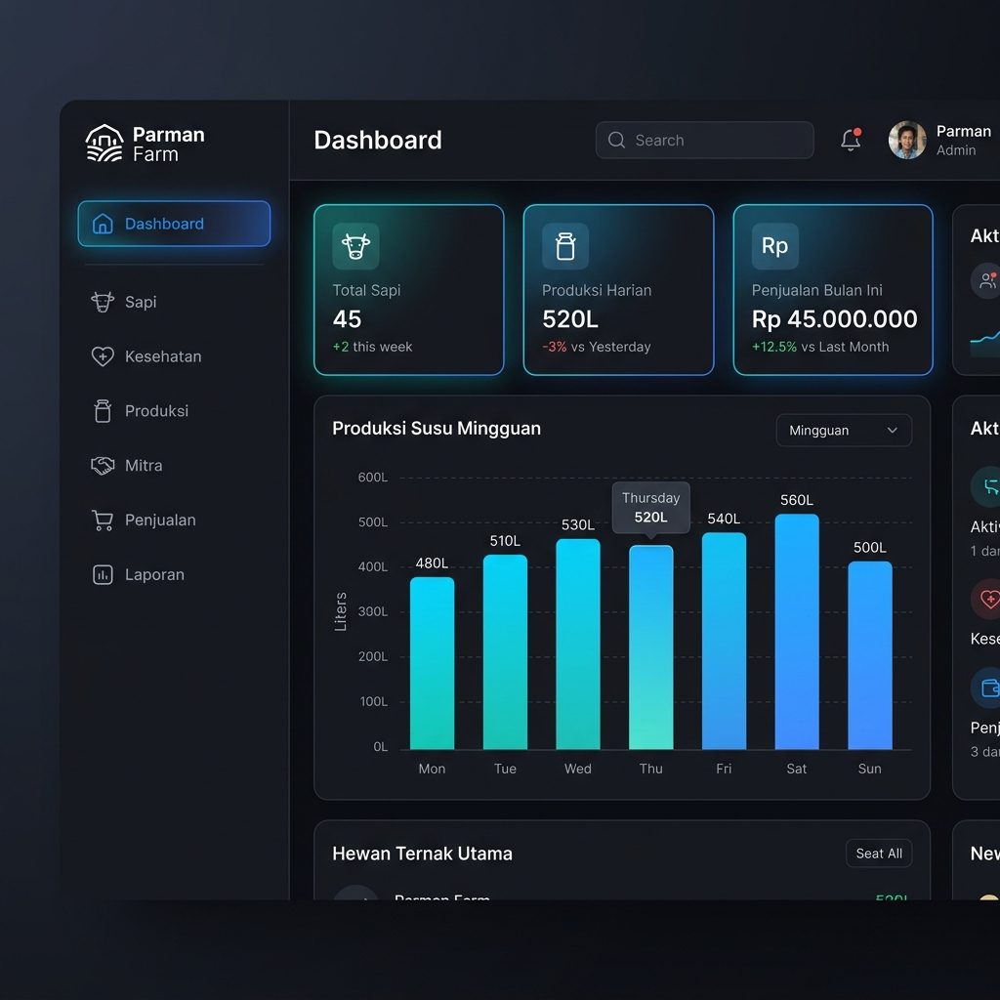
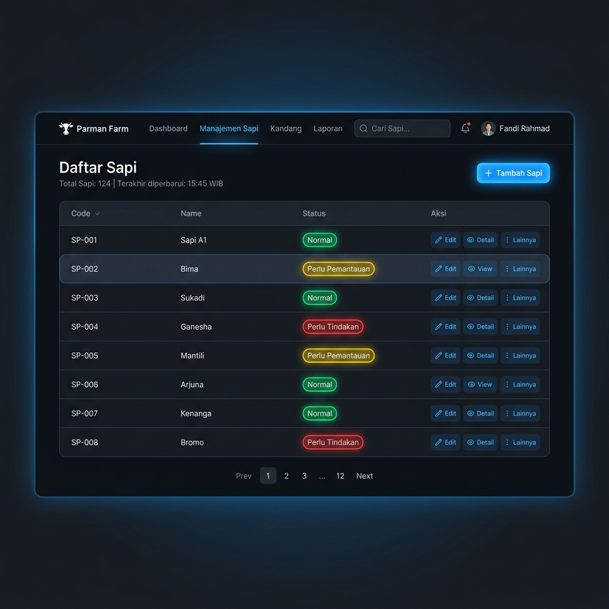

# MANUAL PENGGUNA (USER MANUAL) - PARMAN FARM
## Aplikasi Manajemen Peternakan Sapi Perah & Penjualan

Dokumen ini merupakan panduan bagi pengguna (*Owner*, *Admin/Operator Peternakan*) dalam mengoperasikan sistem manajemen peternakan **Parman Farm**.

---

## 1. Peran Pengguna (User Roles)

Aplikasi memiliki dua level hak akses utama:
1. **Owner (Pemilik Peternakan):**
   - Hak penuh untuk melihat laporan keuangan, grafik penjualan, ringkasan produksi harian, bulanan, dan tahunan.
   - Mengelola data user lainnya.
2. **Karyawan (Operator Peternakan):**
   - Melakukan input harian data sapi, pemeriksaan kesehatan sapi, jumlah susu yang diproduksi, dan menginput penjualan ke mitra.

---

## 2. Panduan Penggunaan Fitur

### A. Dashboard Utama
Setelah login, Anda akan diarahkan ke halaman Dashboard yang menampilkan ringkasan data peternakan secara *real-time*:
- Total sapi aktif.
- Rata-rata produksi susu harian.
- Grafik penjualan dan tren pendapatan.
- Status kesehatan sapi (Normal, Perlu Pemantauan, Perlu Tindakan).

---

### B. Manajemen Sapi (Data Ternak)
Menu ini digunakan untuk mendata seluruh sapi yang ada di peternakan.

- **Melihat Daftar Sapi:** Masuk ke menu **Sapi**. Anda akan melihat daftar sapi beserta nama, kode unik, dan statusnya.
- **Menambah Sapi Baru:**
  1. Klik tombol **Tambah Sapi**.
  2. Masukkan **Nama Sapi** (misal: *Sapi A1*) dan **Kode Sapi** (misal: *SP-001*).
  3. Pilih status awal (Default: *normal*).
  4. Klik **Simpan**.
- **Mengubah/Menghapus Sapi:** Gunakan tombol aksi di sebelah kanan baris tabel sapi untuk mengubah detail data atau menghapusnya jika sapi terjual/mati.

---

### C. Catatan Kesehatan (Kesehatan Sapi)
Menu ini penting untuk mencatat perkembangan medis sapi demi menjaga kualitas produksi susu.
- **Menambah Catatan Kesehatan:**
  1. Klik menu **Kesehatan**, lalu klik **Tambah Catatan**.
  2. Pilih **Sapi** yang diperiksa berdasarkan kode atau namanya.
  3. Isi indikator kesehatan:
     - **Nafsu Makan** (Baik / Menurun / Sangat Buruk).
     - **Kondisi Susu** (Normal / Encer / Bercampur Darah / dll).
     - **Perilaku** (Aktif / Lemas / Gelisah).
     - **Catatan Tambahan** (opsional, misal: diberikan obat cacing).
  4. Tentukan **Status Kesehatan**:
     - *Normal*: Sapi sehat dan siap diperah.
     - *Perlu Pemantauan*: Kondisi agak lemas namun belum parah.
     - *Perlu Tindakan*: Sakit keras, memerlukan kunjungan dokter hewan.
  5. Klik **Simpan**.

---

### D. Catatan Produksi Susu (Produksi)
Digunakan untuk mencatat hasil perahan susu sapi harian.
- **Menambah Catatan Produksi:**
  1. Klik menu **Produksi** -> **Tambah Produksi**.
  2. Pilih **Sapi** yang diperah.
  3. Isi **Jumlah Susu** dalam satuan liter (misal: *12.50*).
  4. Pilih **Sesi** perahan (*Pagi* atau *Sore*).
  5. Isi **Tanggal** perasan susu dilakukan.
  6. Klik **Simpan**.

---

### E. Manajemen Mitra
Mitra adalah pihak ketiga (klien/pembeli industri) tempat Anda mendistribusikan susu atau menjual sapi.
- **Menambah Mitra Baru:**
  1. Masuk ke menu **Mitra** -> **Tambah Mitra**.
  2. Isi **Nama Mitra** (misal: *PT Greenfields Indonesia*), **Kontak** (nomor telepon), **Alamat**, dan **Catatan**.
  3. Klik **Simpan**.

---

### F. Pencatatan Penjualan
Digunakan untuk merekam transaksi penjualan susu/sapi ke Mitra.
- **Mencatat Transaksi Penjualan:**
  1. Masuk ke menu **Penjualan** -> **Tambah Transaksi**.
  2. Pilih **Mitra** tujuan.
  3. Masukkan **Jumlah Terjual** (misal: jumlah liter susu atau ekor sapi).
  4. Masukkan **Total Pendapatan** (Nilai uang dalam Rupiah).
  5. Masukkan **Tanggal Transaksi**.
  6. Pilih **Metode Pembayaran** (Transfer Bank / Tunai).
  7. Pilih **Status Pembayaran** (Selesai / Pending / Dibatalkan).
  8. Tambahkan **Catatan** jika diperlukan.
  9. Klik **Simpan**.

---

### G. Laporan (Reports)
Halaman laporan menampilkan rekapan data yang dapat difilter berdasarkan jangka waktu tertentu (Mingguan/Bulanan/Tahunan) dan diekspor untuk kebutuhan rapat owner.
- Gunakan filter tanggal di bagian atas halaman Laporan.
- Klik **Filter** untuk menampilkan data yang relevan.
- Gunakan tombol **Cetak / Ekspor PDF** (jika terpasang) untuk mencetak laporan resmi peternakan.
