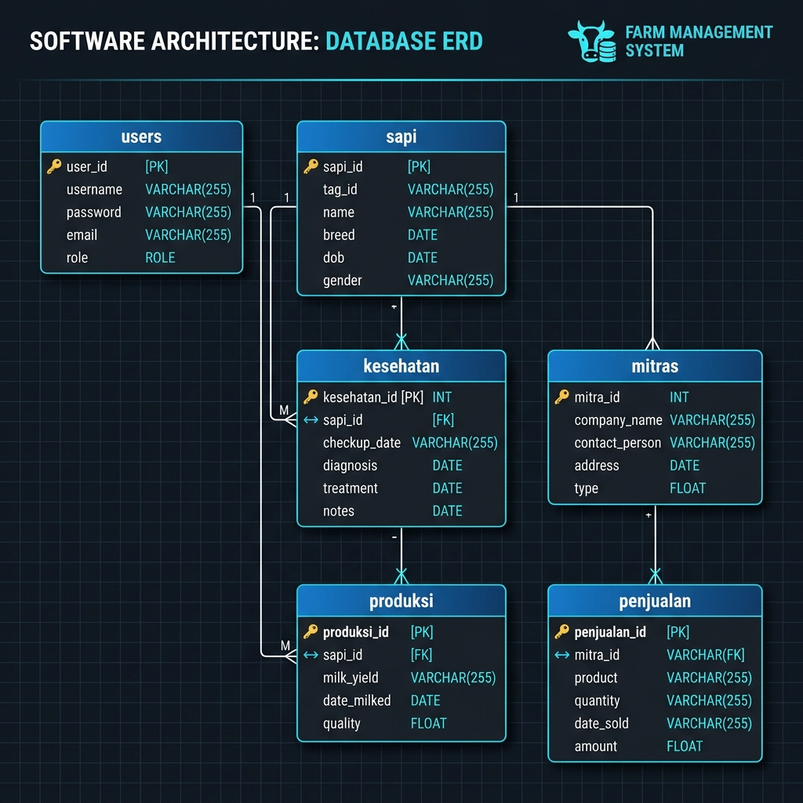
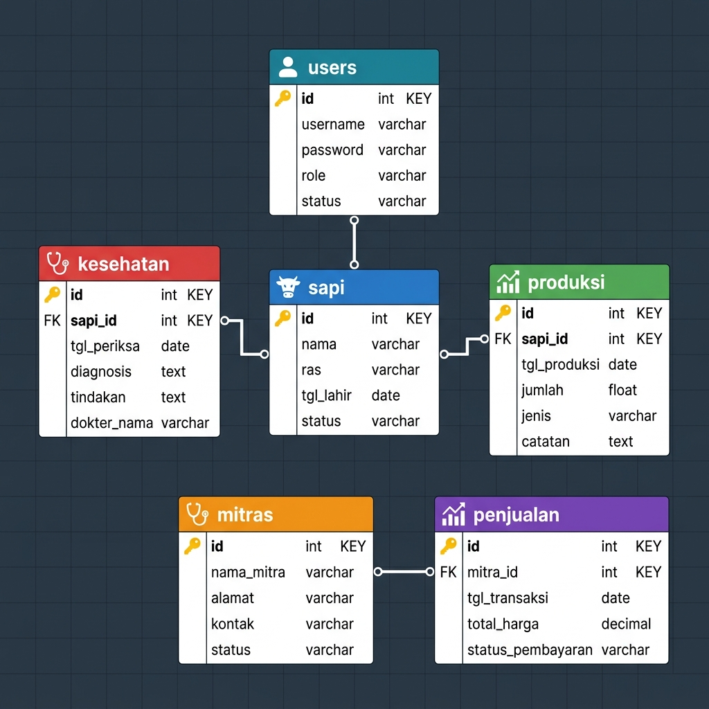
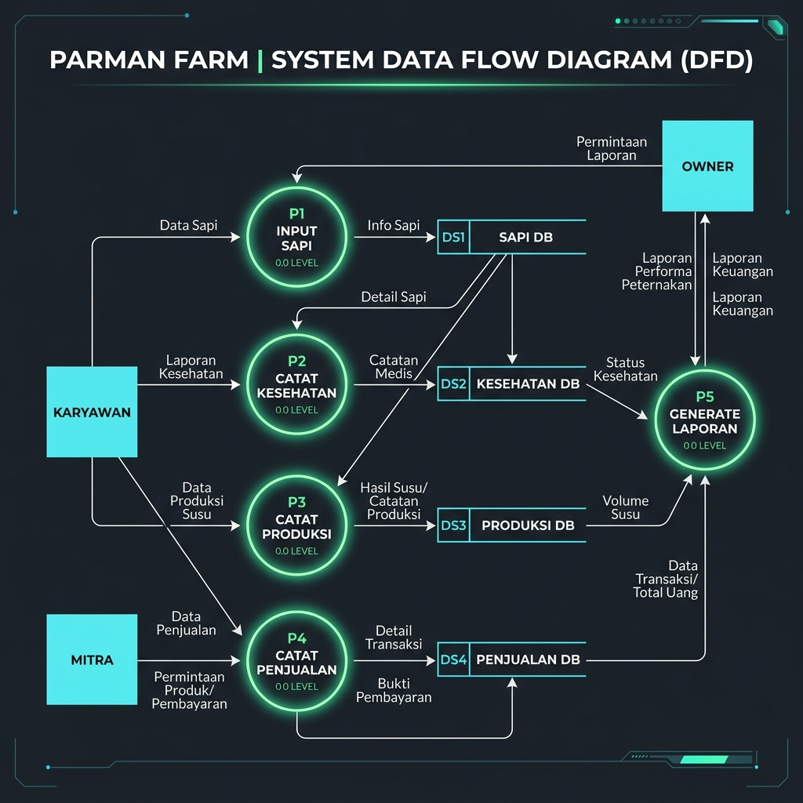

# DOKUMENTASI TEKNIS (TECHNICAL SPECIFICATION) - PARMAN FARM
## Sistem Informasi Manajemen Peternakan Sapi & Penjualan

Dokumen ini ditujukan untuk tim teknis (developer / administrator sistem) untuk memahami struktur, instalasi, dan pemeliharaan aplikasi **Parman Farm**.

---

## 1. Spesifikasi Teknologi (Tech Stack)

Aplikasi dibangun menggunakan teknologi berikut:
- **Backend Framework:** Laravel (PHP >= 8.1)
- **Database:** MariaDB / MySQL >= 10.4
- **Frontend Assets:** Vite + Vanilla CSS / TailwindCSS
- **Server Environment:** Laragon (Local Development) / Docker (Opsional) / Nginx (Production)

---

## 2. Struktur Database (Database Schema)

### Diagram ERD (Entity Relationship Diagram)


### Skema Relasi Tabel Database


Aplikasi memiliki beberapa tabel penting yang saling berelasi:

### A. Tabel `users`
Menyimpan data pengguna sistem.
- `id` (Primary Key)
- `name` (string)
- `email` (string, unique)
- `password` (string)
- `role` (string) - `owner` atau `operator`

### B. Tabel `sapi`
Menyimpan data hewan ternak.
- `id` (Primary Key)
- `name` (string)
- `code` (string, unique)
- `status` (string) - `normal`, `perlu_pemantauan`, `perlu_tindakan`

### C. Tabel `kesehatan`
Menyimpan riwayat pemeriksaan kesehatan sapi.
- `id` (Primary Key)
- `sapi_id` (Foreign Key -> `sapi.id`)
- `nafsu_makan` (string)
- `kondisi_susu` (string)
- `perilaku` (string)
- `catatan` (text, nullable)
- `status` (string) - `Normal`, `Perlu Pemantauan`, `Perlu Tindakan`

### D. Tabel `produksi`
Menyimpan hasil perahan susu harian per sapi.
- `id` (Primary Key)
- `sapi_id` (Foreign Key -> `sapi.id`)
- `jumlah_susu` (decimal 8,2) - dalam liter
- `sesi` (string) - `pagi`, `sore`
- `tanggal` (date)
- `status` (string) - `Tersimpan`, `Belum Input`

### E. Tabel `mitras`
Menyimpan data mitra industri/pembeli.
- `id` (Primary Key)
- `nama` (string)
- `kontak` (string)
- `alamat` (string)
- `catatan` (text, nullable)

### F. Tabel `penjualan`
Menyimpan data transaksi penjualan produk ke mitra.
- `id` (Primary Key)
- `mitra_id` (Foreign Key -> `mitras.id`)
- `jumlah_terjual` (decimal 8,2)
- `total_pendapatan` (decimal 12,2)
- `metode` (string) - default `Transfer Bank`
- `status` (string) - default `Selesai`
- `catatan` (text, nullable)
- `tanggal` (date)

---

## 3. Data Flow Diagram (DFD)

Berikut adalah diagram alir data (DFD) yang menggambarkan bagaimana data mengalir antara entitas eksternal (Owner, Karyawan, Mitra) dan proses-proses utama dalam sistem Parman Farm:



### Rincian Aliran Data & Proses DFD

Diagram di atas membagi sistem menjadi beberapa komponen utama:

#### A. Entitas Eksternal (Aktor)
1. **Owner (Pemilik Peternakan):** Pengguna dengan hak akses tertinggi. Menginput data master sapi, mitra, transaksi penjualan, dan menerima luaran laporan keuangan & operasional secara berkala.
2. **Karyawan (Operator Lapangan):** Pengguna operasional yang bertanggung jawab melakukan input harian rekam kesehatan sapi dan hasil perahan susu sapi.
3. **Mitra (Pembeli/Distributor):** Pihak luar yang berinteraksi dalam transaksi penjualan susu atau sapi. Data mitra diinput oleh Owner.

#### B. Deskripsi Aliran Data per Proses Utama
* **Proses 1.0 - Autentikasi & Login:**
  - **Aliran Masuk:** Pengguna (Owner/Karyawan) mengirimkan data kredensial login (email/username & password).
  - **Aliran Keluar:** Sistem memvalidasi data terhadap datastore `users`. Jika sukses, sistem mengembalikan data session login dan mengarahkan pengguna ke dashboard sesuai role masing-masing.
* **Proses 2.0 - Manajemen Sapi (Data Ternak):**
  - **Aliran Masuk:** Owner menginput nama sapi dan kode unik sapi baru ke dalam sistem.
  - **Aliran Keluar:** Data disimpan ke datastore `sapi`. Daftar data sapi dikirim kembali ke antarmuka pengguna untuk ditampilkan di tabel Sapi.
* **Proses 3.0 - Rekam Kesehatan Ternak:**
  - **Aliran Masuk:** Karyawan (atau Owner) menginput data pemeriksaan sapi (nafsu makan, kondisi susu, perilaku, catatan, status) serta memilih ID/kode sapi yang bersangkutan.
  - **Aliran Keluar:** Data riwayat medis ini disimpan ke datastore `kesehatan` dengan relasi berbasis `sapi_id`.
* **Proses 4.0 - Pencatatan Produksi Susu:**
  - **Aliran Masuk:** Karyawan (atau Owner) menginput jumlah liter hasil perahan susu, sesi perahan (pagi/sore), tanggal, dan ID sapi.
  - **Aliran Keluar:** Data disimpan ke datastore `produksi` (berelasi dengan `sapi_id`) untuk memperbarui data statistik harian.
* **Proses 5.0 - Manajemen Kemitraan (Mitra):**
  - **Aliran Masuk:** Owner menginput data profil mitra industri pembeli (nama, kontak, alamat, catatan).
  - **Aliran Keluar:** Profil disimpan ke datastore `mitras`.
* **Proses 6.0 - Pencatatan Transaksi Penjualan:**
  - **Aliran Masuk:** Owner menginput penjualan dengan memilih Mitra pembeli dari list, mengisi jumlah liter/ternak terjual, total pendapatan uang, tanggal, metode pembayaran, dan status pembayaran.
  - **Aliran Keluar:** Data transaksi keuangan disimpan ke datastore `penjualan` dengan relasi `mitra_id`.
* **Proses 7.0 - Generasi Laporan & Visualisasi:**
  - **Aliran Masuk:** Proses ini menarik data kumulatif secara dinamis dari datastore `produksi` (untuk grafik produksi), `penjualan` (untuk pendapatan keuangan), `sapi` (untuk status total hewan), dan `kesehatan` (untuk statistik kesehatan kandang).
  - **Aliran Keluar:** Data dikalkulasikan dan dikirim kembali kepada **Owner** dalam bentuk visual grafik tren penjualan, total susu mingguan, persentase sapi sakit, serta tabel rekapitulasi keuangan yang dapat dicetak.

---

## 4. Langkah Instalasi di Lingkungan Lokal (Development Setup)

1. **Klon Repositori:**
   ```bash
   git clone <repository-url>
   cd parman-farm
   ```

2. **Instal Dependensi PHP (Composer):**
   ```bash
   composer install
   ```

3. **Instal Dependensi Node (NPM):**
   ```bash
   npm install
   ```

4. **Konfigurasi Environment:**
   Salin `.env.example` menjadi `.env` dan sesuaikan kredensial database Anda:
   ```bash
   cp .env.example .env
   ```

5. **Generate Application Key:**
   ```bash
   php artisan key:generate
   ```

6. **Jalankan Migrasi & Seeder Database:**
   ```bash
   php artisan migrate --seed
   ```

7. **Jalankan Vite Server (untuk compile CSS/JS):**
   ```bash
   npm run dev
   ```

8. **Akses Aplikasi:**
   Gunakan Laragon (misal: `http://parman-farm.test`) atau jalankan PHP built-in server:
   ```bash
   php artisan serve
   ```

---

## 5. Panduan Deployment Ke Server Produksi (VPS Nginx)

1. Pastikan server produksi memiliki PHP >= 8.1 dan database MySQL/MariaDB.
2. Arahkan *Document Root* Nginx ke folder `/public` dari proyek Laravel Anda.
3. Ubah `.env` ke mode production:
   ```env
   APP_ENV=production
   APP_DEBUG=false
   ```
4. Jalankan perintah optimasi Laravel di server produksi:
   ```bash
   php artisan config:cache
   php artisan route:cache
   php artisan view:cache
   ```
