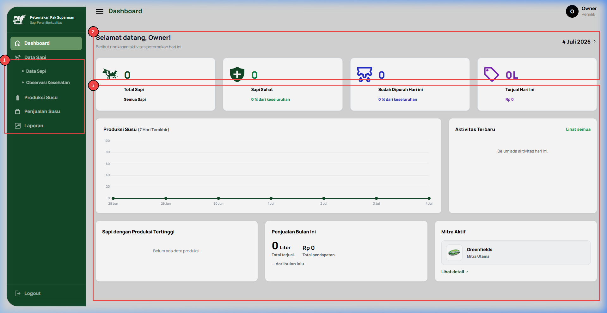
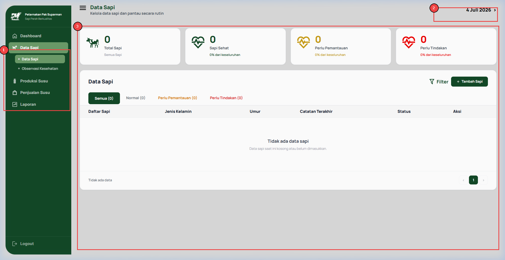
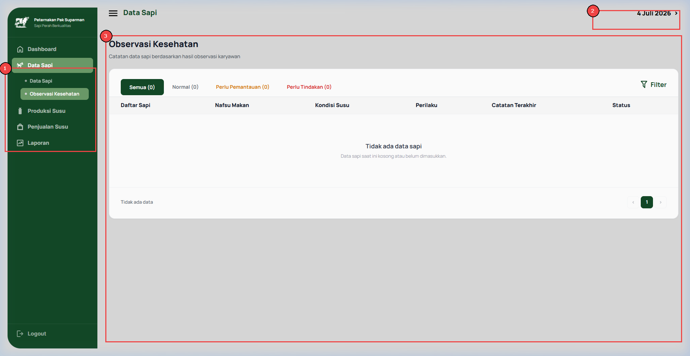
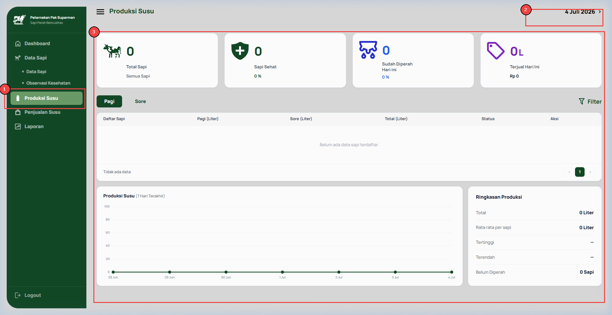
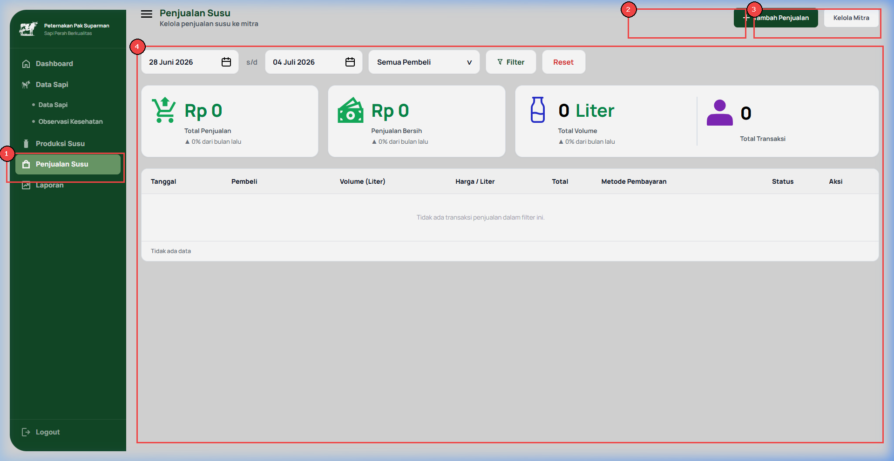
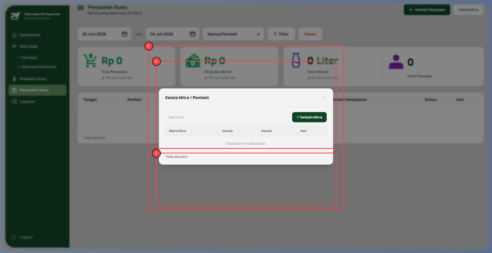
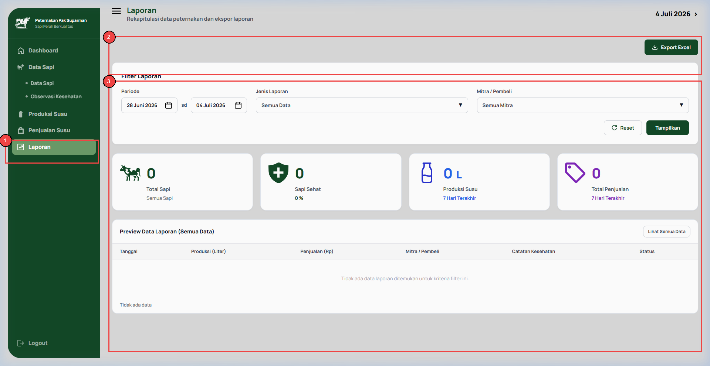

# DOKUMEN SERAH TERIMA PROYEK (PROJECT HANDOVER DOCUMENTATION)

## PARMAN FARM — Aplikasi Manajemen Peternakan Sapi Perah & Penjualan

* **Versi Aplikasi:** v1.0
* **Tanggal Serah Terima:** Juli 2026
* **Developer:** David Stanley
* **Klien:** Julian (Suparman Farms)

---

## Daftar Isi
1. [Ringkasan Proyek & Aplikasi](#1-ringkasan-proyek--aplikasi)
2. [Berita Acara Serah Terima (BAST)](#2-berita-acara-serah-terima-bast)
3. [Manual Pengguna (User Manual) & Panduan Visual](#3-manual-pengguna-user-manual--panduan-visual)
4. [Dokumentasi Teknis & Arsitektur](#4-dokumentasi-teknis--arsitektur)
5. [User Acceptance Testing (UAT)](#5-user-acceptance-testing-uat)
6. [Daftar Kredensial & Inventaris Aset](#6-daftar-kredensial--inventaris-aset)
7. [Rencana Pemeliharaan & SLA](#7-rencana-pemeliharaan--sla)

---

## 1. Ringkasan Proyek & Aplikasi

Dokumen ini merupakan paket serah terima (*handover*) resmi untuk proyek pengembangan **Aplikasi Manajemen Peternakan Parman Farm**. Dokumen ini menggabungkan seluruh materi yang diperlukan oleh Klien (Parman Farm) untuk menerima, mengoperasikan, dan memelihara aplikasi setelah masa pengembangan selesai.

### Ringkasan Aplikasi

| Item | Deskripsi |
| :--- | :--- |
| **Nama Proyek** | SaaS Peternakan Parman Farm |
| **Jenis Aplikasi** | Aplikasi SaaS Manajemen Peternakan Sapi Perah (Web Based) |
| **Versi Aplikasi** | v1.0 |
| **Tech Stack Utama** | Laravel (PHP >= 8.3), MySQL/MariaDB >= 10.4, Vite + Vanilla CSS / TailwindCSS |
| **Peran Pengguna** | Owner (Pemilik Peternakan) dan Karyawan (Operator Lapangan) |
| **Modul Utama** | Dashboard, Data Sapi, Observasi Kesehatan, Produksi Susu, Penjualan, Laporan |

---

## 2. Berita Acara Serah Terima (BAST)

Pada hari ini, **Jum’at, Tanggal 3 Bulan Juli Tahun 2026**, kami yang bertanda tangan di bawah ini:

1. **Pihak Pertama (Developer):**
   * **Nama:** David Stanley
   * **Jabatan:** Software Engineer / Project Manager
   * **Alamat:** Sleman, Yogyakarta
   * *Bertindak untuk dan atas nama pengembang aplikasi, selanjutnya disebut sebagai PIHAK PERTAMA.*

2. **Pihak Kedua (Klien):**
   * **Nama:** Julian
   * **Jabatan:** Owner / Perwakilan Klien
   * **Instansi:** Suparman Farms
   * **Alamat:** -
   * *Bertindak untuk dan atas nama instansi pemilik proyek, selanjutnya disebut sebagai PIHAK KEDUA.*

### Pernyataan Bersama:
1. PIHAK PERTAMA telah menyelesaikan pengerjaan dan menyerahkan seluruh hasil pekerjaan berupa **Aplikasi SaaS Manajemen Peternakan Sapi Perah (Web-Based)** beserta dokumen pendukung terkait kepada PIHAK KEDUA.
2. PIHAK KEDUA telah memeriksa, menguji, dan menerima seluruh hasil pekerjaan yang diserahkan oleh PIHAK PERTAMA dengan hasil baik sesuai dengan spesifikasi yang disepakati (sebagaimana tercantum dalam Dokumen UAT yang terlampir).
3. Terhitung sejak tanggal penandatanganan Berita Acara ini, maka hak kepemilikan dan penggunaan aplikasi sepenuhnya beralih dari PIHAK PERTAMA kepada PIHAK KEDUA.
4. PIHAK PERTAMA memberikan masa garansi pemeliharaan (*maintenance*) selama 1 bulan, terhitung sejak ditandatanganinya Berita Acara ini, dengan ketentuan sebagaimana diatur dalam Dokumen Rencana Pemeliharaan.

---

## 3. Manual Pengguna (User Manual) & Panduan Visual

Panduan ini bertujuan memandu pengguna (**Owner** dan **Karyawan/Operator**) dalam mengoperasikan sistem informasi manajemen Parman Farm.

### 3.1 Peran Pengguna (User Roles)
Sistem membagi hak akses ke dalam dua tingkat:
1. **Owner (Pemilik Peternakan):** Memiliki hak penuh untuk melihat seluruh data keuangan, grafik penjualan, ringkasan produksi, mengelola data mitra, serta mencetak laporan periodik.
2. **Karyawan (Operator Lapangan):** Bertanggung jawab menginput rekam kesehatan harian sapi, mencatat produksi perahan susu per sapi, dan mencatat transaksi penjualan harian.

---

### 3.2 Dashboard Utama
Halaman ringkasan eksekutif setelah login yang menyajikan statistik peternakan secara real-time.



#### Panduan Visual Dashboard:
1. **[1] Sidebar Menu:** Panel navigasi utama untuk berpindah halaman (Dashboard, Data Sapi, Observasi Kesehatan, Produksi Susu, Penjualan Susu, dan Laporan).
2. **[2] Statistik Utama:** Menampilkan metrik penting secara ringkas seperti Total Sapi Aktif, Rata-rata Produksi Susu Harian (liter), Total Penjualan Bulan Ini, dan Grafik Proporsi Kesehatan Sapi.
3. **[3] Grafik Tren Penjualan & Kesehatan:** Diagram visual interaktif yang menggambarkan grafik tren omzet bulanan dan statistik rekam medis sapi.

---

### 3.3 Manajemen Sapi (Data Ternak)
Modul untuk mencatat identitas populasi sapi di peternakan.



#### Cara Penggunaan:
1. **[1] Navigasi Data Sapi:** Klik submenu "Data Sapi" di dalam grup menu "Data Sapi" pada sidebar.
2. **[2] Tombol Tambah Sapi:** Klik tombol **"Tambah Sapi"** untuk membuka formulir input sapi baru. Masukkan Nama Sapi (contoh: *Sapi A1*) dan Kode Unik (contoh: *SP-001*), kemudian pilih status awal lalu simpan.
3. **[3] Daftar Sapi & Aksi:** Tabel yang menampilkan seluruh sapi terdaftar beserta kodenya. Di kolom kanan, terdapat aksi **Edit** untuk memperbarui data sapi, dan **Hapus** untuk menghapus data jika sapi mati atau terjual.

---

### 3.4 Catatan Kesehatan Sapi
Modul observasi klinis harian untuk memantau kondisi medis hewan ternak.



#### Cara Penggunaan:
1. **[1] Navigasi Observasi:** Pilih submenu **"Observasi Kesehatan"** di sidebar.
2. **[2] Tambah Catatan:** Klik **"Tambah Catatan"** di bagian kanan atas. Isi formulir dengan memilih Sapi, tentukan tingkat nafsu makan (Baik/Menurun/Sangat Buruk), kondisi susu (Normal/Encer/Bercampur Darah), perilaku sapi (Aktif/Lemas/Gelisah), dan catatan medis tambahan. Tentukan juga Status Kesehatan: *Normal*, *Perlu Pemantauan*, atau *Perlu Tindakan*.
3. **[3] Riwayat Kesehatan:** Menampilkan riwayat observasi medis. Jika status sapi diset ke *Perlu Tindakan* atau *Perlu Pemantauan*, indikator status sapi di Dashboard akan diperbarui secara otomatis.

---

### 3.5 Catatan Produksi Susu
Modul pencatatan hasil perahan susu harian untuk memonitor produktivitas.



#### Cara Penggunaan:
1. **[1] Navigasi Produksi:** Klik menu **"Produksi Susu"** di sidebar.
2. **[2] Tombol Tambah Produksi:** Klik **"Tambah Produksi"** untuk mencatat perahan baru. Pada form yang muncul, pilih sapi yang diperah, isi volume perahan susu dalam satuan liter (contoh: *12.5*), pilih sesi perahan (Pagi atau Sore), dan pilih tanggal pencatatan.
3. **[3] Daftar Perahan:** Menampilkan tabel riwayat perahan susu yang terorganisir per sapi, lengkap dengan volume, tanggal, dan sesi.

---

### 3.6 Manajemen Mitra & Transaksi Penjualan
Modul integrasi antara pengelolaan profil mitra industri dan pencatatan transaksi komersial.




#### Cara Penggunaan:
1. **[1] Navigasi Penjualan:** Buka menu **"Penjualan Susu"** pada panel navigasi.
2. **[2] Tombol Kelola Mitra:** Klik **"Kelola Mitra"** untuk menampilkan pop-up modal manajemen mitra. Di dalam modal ini, Anda dapat menambahkan data mitra industri (Nama, Kontak, Alamat, Catatan) dan menghapus mitra yang tidak lagi bekerja sama.
3. **[3] Tombol Tambah Transaksi:** Klik **"Tambah Transaksi"** untuk mencatat transaksi penjualan baru. Isi form penjualan dengan memilih Mitra pembeli, volume penjualan (liter/ekor), total nilai pendapatan (Rupiah), tanggal transaksi, metode pembayaran (Transfer Bank / Tunai), dan status transaksi (Selesai/Pending/Batal).
4. **[4] Riwayat Penjualan:** Tabel ringkasan dari semua riwayat transaksi penjualan yang telah berhasil disimpan ke database.

---

### 3.7 Laporan (Reports)
Modul untuk menganalisis kinerja peternakan dan keuangan secara berkala.



#### Cara Penggunaan:
1. **[1] Navigasi Laporan:** Klik menu **"Laporan"** di sidebar.
2. **[2] Filter Rentang Tanggal:** Tentukan tanggal awal dan tanggal akhir pencatatan, kemudian klik tombol filter untuk menyaring data produksi dan penjualan berdasarkan jangka waktu yang diinginkan.
3. **[3] Cetak Laporan:** Klik tombol **"Cetak Laporan"** (ikon printer) untuk mencetak laporan operasional peternakan atau mengekspornya ke format PDF secara rapi.
4. **[4] Data Kumulatif:** Laporan secara otomatis akan mengakumulasikan total produksi susu per sapi dan rincian transaksi penjualan komersial sesuai dengan rentang tanggal yang telah difilter.

---

## 4. Dokumentasi Teknis & Arsitektur

### 4.1 Spesifikasi Teknologi (Tech Stack)
*   **Backend Framework:** Laravel (PHP >= 8.3)
*   **Database Engine:** MySQL / MariaDB >= 10.4
*   **Frontend Compiler & Styling:** Vite + Vanilla CSS / TailwindCSS
*   **Server Environment:** Laragon (Lokal) / Nginx (VPS Server Produksi)

### 4.2 Struktur Database
#### Diagram ERD (Entity Relationship Diagram)


#### Skema Relasi Tabel Database


#### Rincian Tabel Database Utama:
1.  **Tabel `users` (Data Pengguna):**
    *   `id` (BigInt, PK)
    *   `name` (Varchar): Nama pengguna.
    *   `email` (Varchar, Unique): Username login.
    *   `password` (Varchar): Hash sandi pengguna.
    *   `role` (Varchar): Peran akses (`owner` atau `operator`).
2.  **Tabel `sapi` (Identitas Ternak):**
    *   `id` (BigInt, PK)
    *   `name` (Varchar): Nama panggilan sapi.
    *   `code` (Varchar, Unique): Kode tag telinga sapi (misal: SP-001).
    *   `status` (Varchar): Status klinis (`normal`, `perlu_pemantauan`, `perlu_tindakan`).
3.  **Tabel `kesehatan` (Rekam Medis):**
    *   `id` (BigInt, PK)
    *   `sapi_id` (BigInt, FK -> `sapi.id`): Sapi yang diperiksa.
    *   `nafsu_makan` (Varchar): `Baik`, `Menurun`, atau `Sangat Buruk`.
    *   `kondisi_susu` (Varchar): Deskripsi kualitas susu saat ini.
    *   `perilaku` (Varchar): Kondisi psikomotorik sapi (`Aktif`, `Lemas`, `Gelisah`).
    *   `status` (Varchar): Hasil pemeriksaan (`Normal`, `Perlu Pemantauan`, `Perlu Tindakan`).
    *   `catatan` (Text, Nullable): Keterangan klinis tambahan dari operator.
4.  **Tabel `produksi` (Hasil Perahan):**
    *   `id` (BigInt, PK)
    *   `sapi_id` (BigInt, FK -> `sapi.id`): Sapi yang diperah.
    *   `jumlah_susu` (Decimal 8,2): Volume perahan susu dalam liter.
    *   `sesi` (Varchar): Sesi perahan (`pagi` atau `sore`).
    *   `tanggal` (Date): Tanggal perahan dilakukan.
    *   `status` (Varchar): Status pencatatan (`Tersimpan` / `Belum Input`).
5.  **Tabel `mitras` (Data Pelanggan/Mitra):**
    *   `id` (BigInt, PK)
    *   `nama` (Varchar): Nama perusahaan/mitra pembeli.
    *   `kontak` (Varchar): Nomor telepon/kontak aktif.
    *   `alamat` (Varchar): Alamat lengkap mitra.
    *   `catatan` (Text, Nullable): Informasi tambahan.
6.  **Tabel `penjualan` (Transaksi Komersial):**
    *   `id` (BigInt, PK)
    *   `mitra_id` (BigInt, FK -> `mitras.id`): Pembeli transaksi.
    *   `jumlah_terjual` (Decimal 8,2): Volume susu (liter) atau jumlah hewan terjual.
    *   `total_pendapatan` (Decimal 12,2): Total nilai uang yang diterima (Rupiah).
    *   `metode` (Varchar): `Transfer Bank` atau `Tunai`.
    *   `status` (Varchar): `Selesai`, `Pending`, atau `Dibatalkan`.
    *   `tanggal` (Date): Tanggal pencatatan transaksi penjualan.
    *   `catatan` (Text, Nullable): Informasi penunjang lainnya.

---

### 4.3 Data Flow Diagram (DFD)
Diagram di bawah ini menggambarkan alir data dari aktor eksternal (Owner, Karyawan, Mitra) ke dalam sistem Parman Farm:


#### Deskripsi Proses Utama DFD:
*   **Proses 1.0 - Autentikasi & Login:** Validasi username/password terhadap datastore `users` dan mengarahkan pengguna ke dashboard sesuai role masing-masing.
*   **Proses 2.0 - Manajemen Sapi:** Penginputan identitas ternak sapi ke datastore `sapi`.
*   **Proses 3.0 - Rekam Kesehatan Ternak:** Operator memasukkan rekam medis harian yang disimpan ke datastore `kesehatan` berelasi dengan `sapi_id`.
*   **Proses 4.0 - Pencatatan Produksi Susu:** Pencatatan volume susu harian yang masuk ke datastore `produksi`.
*   **Proses 5.0 - Manajemen Kemitraan:** Owner mendaftarkan biodata profil pelanggan industri ke datastore `mitras`.
*   **Proses 6.0 - Pencatatan Transaksi Penjualan:** Owner atau operator memasukkan penjualan ke datastore `penjualan` berelasi `mitra_id`.
*   **Proses 7.0 - Generasi Laporan & Visualisasi:** Menarik data komulatif dari semua datastore untuk diolah dan divisualisasikan dalam bentuk grafik serta tabel cetak bagi Owner.

---

### 4.4 Langkah Instalasi di Lingkungan Lokal (Development Setup)

1.  **Klon Repositori & Masuk ke Direktori Proyek:**
    ```bash
    git clone <repository-url>
    cd parman-farm
    ```
2.  **Instal Dependensi PHP (Composer):**
    ```bash
    composer install
    ```
3.  **Instal Dependensi Node (NPM):**
    ```bash
    npm install
    ```
4.  **Konfigurasi Environment:**
    Salin berkas `.env.example` menjadi `.env`:
    *   Untuk Windows (CMD): `copy .env.example .env`
    *   Untuk Linux/macOS/Git Bash: `cp .env.example .env`
    
    Setelah disalin, buka berkas `.env` dan sesuaikan parameter database MySQL Anda (nama DB, username, password).
5.  **Generate Application Key:**
    ```bash
    php artisan key:generate
    ```
6.  **Buat Database Baru:**
    Buka panel basis data lokal Anda (misal phpMyAdmin atau Laragon MySQL) dan buat database kosong baru sesuai dengan konfigurasi berkas `.env` Anda (contoh: `parman-farm`).
7.  **Jalankan Migrasi & Seeder Database:**
    ```bash
    php artisan migrate --seed
    ```
8.  **Jalankan Vite Development Server:**
    ```bash
    npm run dev
    ```
9.  **Akses Aplikasi:**
    Gunakan web server Laragon (contoh: `http://parman-farm.test`) atau jalankan server built-in bawaan PHP:
    ```bash
    php artisan serve
    ```

---

### 4.5 Panduan Deployment ke Server Produksi (VPS Nginx)

1.  Pastikan VPS produksi telah terpasang **PHP >= 8.3** dan **MySQL/MariaDB >= 10.4**.
2.  Arahkan *Document Root* pada konfigurasi virtual host web server Nginx Anda ke direktori `/public` dari proyek Laravel.
3.  Konfigurasikan berkas `.env` server produksi ke mode production:
    ```env
    APP_ENV=production
    APP_DEBUG=false
    ```
4.  Instal dependensi PHP produksi (tanpa dependensi pengembangan):
    ```bash
    composer install --no-dev --optimize-autoloader
    ```
5.  Kompilasi aset frontend untuk produksi:
    ```bash
    npm install
    npm run build
    ```
6.  Jalankan migrasi database dengan flag keamanan `--force` untuk menghindari prompt interaktif:
    ```bash
    php artisan migrate --force
    ```
7.  Jalankan perintah optimasi kompilasi cache untuk meningkatkan kecepatan respon framework:
    ```bash
    php artisan config:cache
    php artisan route:cache
    php artisan view:cache
    php artisan event:cache
    ```

---

## 5. User Acceptance Testing (UAT)

Lembar pengujian validasi fungsionalitas sistem sebelum proses serah terima resmi ditandatangani.

* **Penguji (Klien):** Julian
* **Status Akhir:** Diterima Penuh (Passed)

| ID | Modul / Fitur | Langkah Pengujian | Hasil yang Diharapkan | Status |
| :--- | :--- | :--- | :--- | :--- |
| **UAT-01** | Autentikasi | Buka halaman `/login`. Masukkan kredensial salah (tampil error); Masukkan kredensial benar (berhasil masuk). | Menampilkan error validasi; masuk ke Dashboard sesuai level role pengguna. | **PASSED** |
| **UAT-02** | Dashboard | Periksa data kuantitatif statistik di dashboard utama (jumlah sapi, rerata produksi harian, grafik status kesehatan). | Seluruh data statistik tampil dinamis mengikuti data riil database. | **PASSED** |
| **UAT-03** | Manajemen Sapi | Tambah sapi baru, lakukan penyuntingan nama/kode, lalu uji tombol hapus. | Data sapi sukses tersimpan dengan kode unik, edit tersimpan, dan data terhapus dari daftar. | **PASSED** |
| **UAT-04** | Catatan Kesehatan | Tambahkan rekam medis baru; set status kesehatan sapi ke *Perlu Tindakan*. | Catatan tersimpan; diagram status kesehatan sapi di dashboard langsung terupdate secara real-time. | **PASSED** |
| **UAT-05** | Produksi Susu | Input volume hasil perah susu per sapi; pilih sesi perahan (pagi/sore) dan tanggal. | Volume perahan masuk ke database dan memperbarui nilai rata-rata produksi harian di dashboard. | **PASSED** |
| **UAT-06** | Manajemen Mitra | Masuk ke pop-up modal mitra; tambahkan nama, kontak, dan alamat mitra baru. | Data mitra tersimpan dan muncul di pilihan dropdown formulir Penjualan. | **PASSED** |
| **UAT-07** | Pencatatan Penjualan| Tambah transaksi penjualan; pilih mitra, isi jumlah terjual, nominal omzet, dan metode bayar. | Transaksi tersimpan ke database, status pembayaran terupdate dengan benar. | **PASSED** |
| **UAT-08** | Laporan Keuangan | Tentukan tanggal mulai dan akhir; tekan filter lalu klik cetak laporan. | Laporan menampilkan total akumulasi volume produksi & pendapatan komersial secara presisi. | **PASSED** |

---

## 6. Daftar Kredensial & Inventaris Aset

> [!WARNING]  
> **SANGAT RAHASIA!**  
> Jagalah kerahasiaan berkas ini dan simpan di pengelola sandi (Password Manager). Klien diwajibkan segera mengganti kata sandi default setelah serah terima selesai dilakukan.

### 6.1 Informasi Domain & DNS Management
*   **Registrar Domain:** Domainesia
*   **URL Login Registrar:** [https://my.domainesia.com/index.php?rp=login](https://my.domainesia.com/index.php?rp=login)
*   **Username / Email Login:** `parmanfarms@gmail.com`
*   **Password:** `Ternaksehat123#`
*   **Nama Domain:** `suparmanfarms.my.id`
*   **Status Langganan:** Aktif s.d 3 Agustus 2026

### 6.2 Server Hosting / VPS
*   **Provider Hosting:** cipressa.id.rapidplex.com (cPanel Hosting)
*   **URL Control Panel:** [https://cipressa.id.rapidplex.com:2083/](https://cipressa.id.rapidplex.com:2083/)
*   **Username Login Panel:** `suparman`
*   **Password Login Panel:** `Ternaksehat123#`
*   **IP Server (Public):** `202.155.137.x`
*   **SSH Username:** `suparman`
*   **SSH Port:** `64000`
*   **Autentikasi SSH:** Aktif

### 6.3 Akses Basis Data (Database)
*   **Database Host:** `localhost` (atau IP cPanel Server internal)
*   **Database Port:** `3306`
*   **Nama Database:** `suparman_farm`
*   **Database Username:** `suparman_farm`
*   **Database Password:** `Ternaksehat`
*   **Link phpMyAdmin:** Diakses langsung melalui menu cPanel PHPMyAdmin.

### 6.4 Akun Administrator Sistem (Default Seed)
Kredensial login awal setelah inisialisasi basis data:
*   **URL Login Aplikasi:** [https://suparmanfarms.my.id/login](https://suparmanfarms.my.id/login)
*   **Akun Owner (Pemilik):**
    *   *Email/Username:* `owner`
    *   *Password:* `12345678`
*   **Akun Karyawan (Operator):**
    *   *Email/Username:* `karyawan`
    *   *Password:* `12345678`

---

### 6.5 Layanan Pihak Ketiga (Third-Party Services)

#### A. SMTP / Pengiriman Email (Untuk Reset Password & Notifikasi)
*   **Provider SMTP:** Mail Server cPanel Domain
*   **SMTP Host:** `mail.suparmanfarms.my.id`
*   **SMTP Port:** `465` (SSL)
*   **SMTP Username:** `_mainaccount@suparmanfarms.my.id`
*   **SMTP Password:** `Ternaksehat123#`

#### B. Penyimpanan Cloud (Penyimpanan Berkas Tambahan)
*   *Tidak Menggunakan Layanan Cloud Eksternal (Semua data media disimpan di lokal direktori VPS).*

#### C. WhatsApp/SMS Gateway (Notifikasi Otomatis)
*   *Tidak Terintegrasi. Aplikasi versi ini belum mengimplementasikan WhatsApp/SMS Gateway otomatis.*

---

## 7. Rencana Pemeliharaan & SLA

### 7.1 Masa Garansi & Perbaikan Bug (Bug Warranty)
*   **Durasi Garansi:** 1 Bulan (Terhitung sejak ditandatanganinya Berita Acara Serah Terima).

#### Cakupan Garansi:
*   Perbaikan gratis atas segala *error* logika program (bug), galat fungsionalitas sistem, atau kegagalan program yang timbul akibat kesalahan pengkodean awal oleh Developer.
*   Penyesuaian minor jika terdapat *glitch* tata letak pada browser web modern (Chrome, Safari, Firefox, Edge).

#### Hal yang TIDAK Dicakup Garansi:
*   Penambahan fitur baru di luar spesifikasi fungsionalitas kesepakatan awal (*change request*).
*   Kerusakan sistem akibat kelalaian Klien (kesalahan konfigurasi server VPS, kehilangan kredensial login, modifikasi kode internal oleh pihak ketiga, serangan siber, atau infeksi malware).
*   Gangguan konektivitas internet hosting/domain yang disebabkan kegagalan provider pihak ketiga.

---

### 7.2 Kebijakan Backup Data
1.  **Backup Database Otomatis (Sangat Direkomendasikan):**
    *   *Frekuensi:* Setiap hari pada pukul 02:00 WIB.
    *   *Format Output:* `.sql` atau `.sql.gz`.
    *   *Penyimpanan:* Tersimpan di direktori lokal VPS yang aman, dan disarankan disinkronkan secara berkala ke penyimpanan awan eksternal (Google Drive / Dropbox).
2.  **Backup Database Manual via Terminal SSH:**
    ```bash
    mysqldump -u suparman_farm -p suparman_farm | gzip > backup_parman_farm_$(date +%F).sql.gz
    ```
3.  **Prosedur Pemulihan Data (Restore):**
    ```bash
    gunzip < backup_parman_farm_yyyy-mm-dd.sql.gz | mysql -u suparman_farm -p suparman_farm
    ```

---

### 7.3 Dukungan Teknis & Service Level Agreement (SLA)
Setelah masa garansi 1 bulan berakhir, Klien dapat mengajukan kontrak pemeliharaan bulanan (*Retainer Maintenance Agreement*).

*   **Saluran Dukungan (Support Channels):**
    *   *WhatsApp Support:* `+628 989136001`

#### SLA Waktu Respon & Solusi Berdasarkan Tingkat Keparahan Masalah:

| Tingkat Keparahan | Deskripsi Masalah | Target Respon | Target Solusi |
| :--- | :--- | :--- | :--- |
| **Kritis (Critical)** | Aplikasi mati total (*down*), basis data tidak bisa diakses, atau kegagalan fatal pada proses transaksi komersial. | Maks. 1 Jam | Maks. 6 Jam |
| **Sedang (Medium)** | Beberapa fitur minor mengalami *error* (misal: widget grafik dashboard tidak muncul), namun aplikasi utama masih dapat diakses dengan baik. | Maks. 4 Jam | Maks. 24 Jam |
| **Rendah (Low)** | Perbaikan minor pada teks dokumentasi, tata letak visual styling, atau konsultasi umum operasional sistem. | Maks. 12 Jam| Maks. 48 Jam |

---

### 7.4 Pemeliharaan Rutin Server Produksi
*   **Pembersihan Berkas Log:** Menghapus berkas log lama Laravel (`/storage/logs/`) secara berkala untuk menghemat ruang penyimpanan.
*   **Pembaruan Patch Keamanan:** Melakukan update versi keamanan minor PHP dan paket sistem operasi linux VPS secara terjadwal.
*   **Pemantauan Ruang Disk:** Memastikan sisa kapasitas penyimpanan server VPS selalu berada di atas batas aman 20%.

---
*Dokumen serah terima ini dibuat secara resmi demi kenyamanan dan kelancaran operasional peternakan Parman Farm.*
